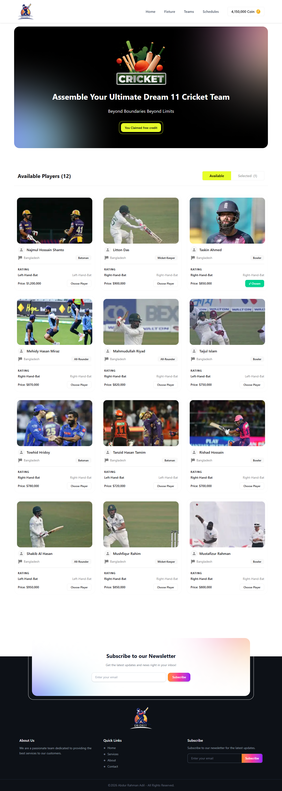
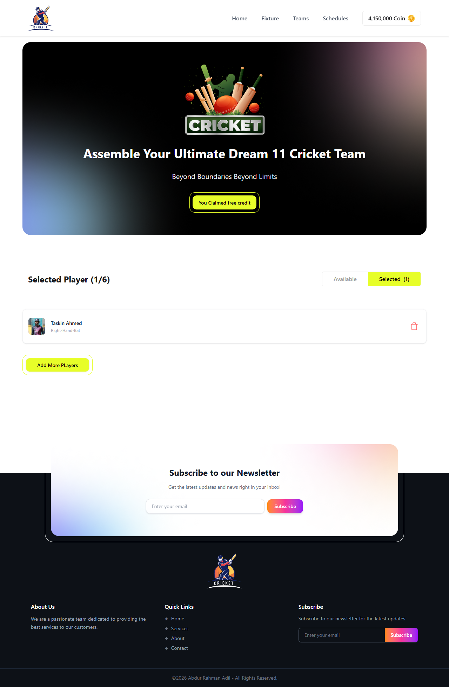

# 🏏 BPL Dream 11

A fantasy cricket web application where users can build their ultimate Dream 11 Bangladesh Premier League team by selecting players within a coin budget.




<br/>



<br/>


## 🌐 Live Demo

🔗 [https://bpl-dream-11-adil.vercel.app](https://bpl-dream-11.netlify.app) <!-- Replace with actual deployed URL -->

---

## 📌 Features

- 🏆 Browse 12 Bangladesh cricket players with real stats
- 💰 Coin-based budget system — claim free credits to start
- ✅ Select up to **6 players** for your dream team
- 🔄 Toggle between **Available Players** and **Selected Players** views
- 🗑️ Remove players from your selected squad anytime
- 📬 Newsletter subscription section
- 📱 Fully **responsive** design (mobile + desktop)
- ⚡ Fast loading with React `Suspense` + `use()` hook

---

## 🛠️ Tech Stack

| Technology | Usage |
|---|---|
| [React 19](https://react.dev/) | UI Framework |
| [Vite](https://vitejs.dev/) | Build Tool |
| [Tailwind CSS v4](https://tailwindcss.com/) | Styling |
| [React Context API](https://react.dev/reference/react/createContext) | Global State Management |
| JavaScript (ES2024) | Logic |


## 🚀 Getting Started

### Prerequisites

- Node.js `>= 18.x`
- npm or yarn

### Installation

```bash
# 1. Clone the repository
git clone https://github.com/SyntaxAdil/BPL-Dream-11.git

# 2. Navigate into the project
cd BPL-Dream-11

# 3. Install dependencies
npm install

# 4. Start the development server
npm run dev
```

The app will be running at `http://localhost:5173`

### Build for Production

```bash
npm run build
```

---

## 🎮 How to Use

1. Open the app and click **"You Claimed Free Credit"** to get starting coins
2. Browse the **Available Players** section
3. Click **"Choose Player"** on any player card to add them to your squad
4. Switch to the **"Selected"** tab to view your chosen team
5. Remove any player using the 🗑️ trash icon
6. You can select a **maximum of 6 players**
7. Each player costs coins — make sure you have enough balance!

---

## 🧩 Key Components

### `PlayerCardSection`
Handles the tab toggle between Available and Selected players. Uses React 19's `use()` hook with `Suspense` for async player data fetching.

### `PlayerContext`
Global state using React Context API. Manages:
- Player list fetching (`fetchPlayer` Promise)
- Selected players (`chosen` array)
- Coin balance

### `PlayerCard`
Displays individual player info: image, name, country, role, batting style, and price. Has a "Choose Player" / "Chosen ✓" toggle button.

### `SelectedPlayerCard`
Shows selected players in a cart-style list with a remove (delete) button.

---

## 📦 Data Format

Players are stored in `src/data/players.json`:

```json
[
  {
    "id": 1,
    "name": "Najmul Hossain Shanto",
    "country": "Bangladesh",
    "role": "Batsman",
    "bat": "Left-Hand-Bat",
    "price": 1200000,
    "image": "https://img1.hscicdn.com/..."
  }
]
```

---

## 🙌 Acknowledgements

- Player images from [ESPNcricinfo](https://www.espncricinfo.com/)
- Cricket icons & assets designed for this project
- Inspired by popular fantasy cricket platforms

---

## 📄 License

This project is open source and available under the [MIT License](./LICENSE).

---

## 👨‍💻 Author

**Adil** — [@SyntaxAdil](https://github.com/SyntaxAdil)

> ⭐ If you found this project helpful, please give it a star on GitHub!